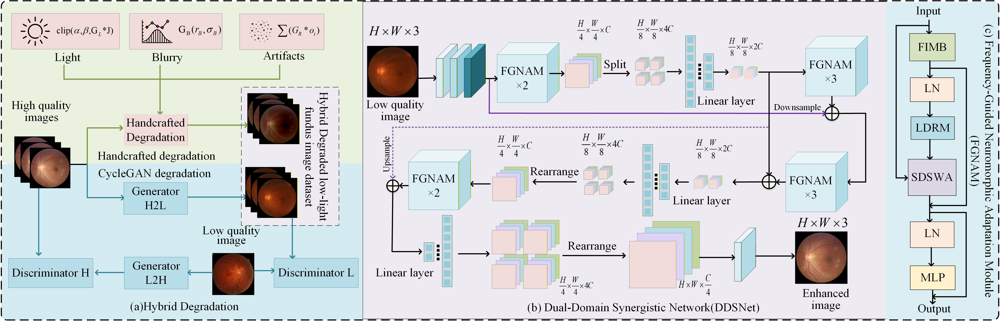
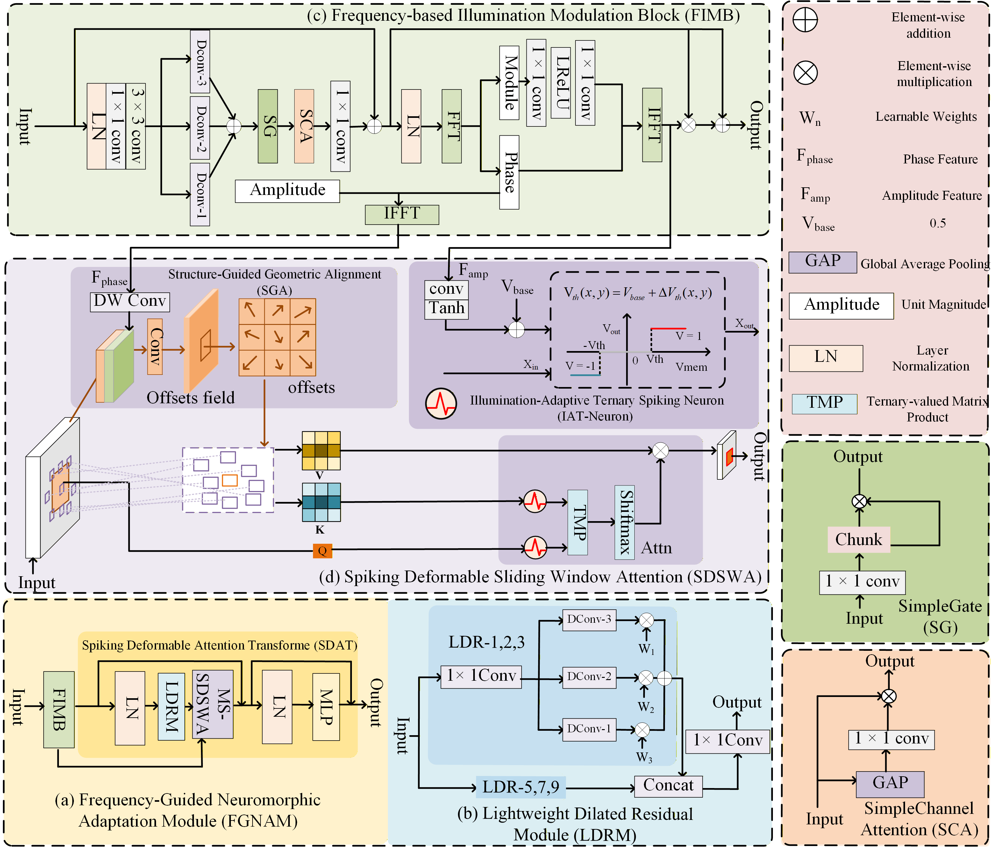
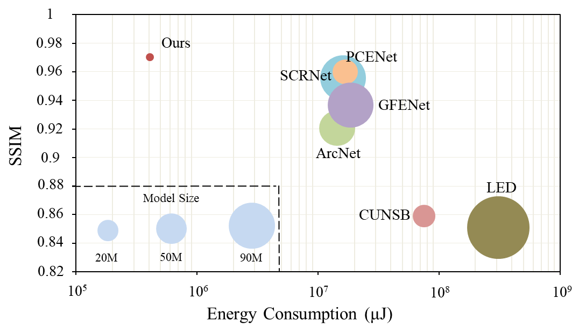
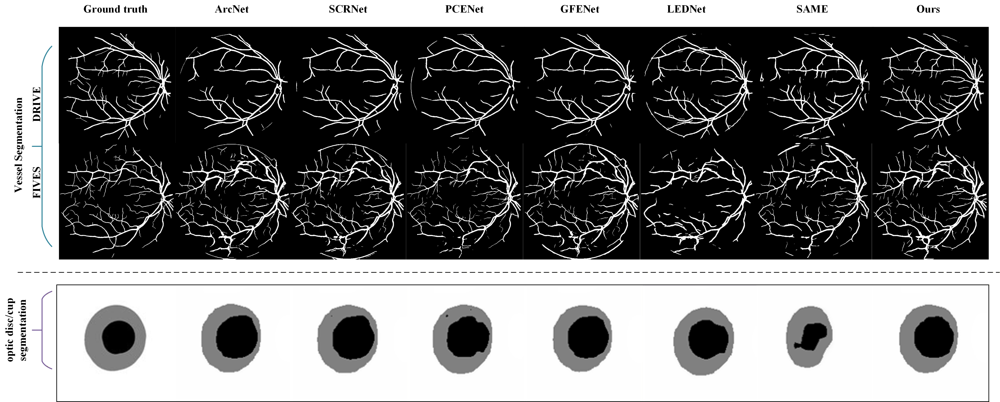

# A Dual-Domain Synergistic Network with Frequency-Guided Neuromorphic Adaptation for Low-Light Fundus Image Enhancement

[](#environment)
[](#environment)
[](#overview)

> Official PyTorch implementation of **DDSN**, a lightweight dual-domain synergistic network for low-light fundus image enhancement.

## Overview

Low-light fundus image enhancement aims to improve the visibility of anatomical structures and pathological regions degraded by suboptimal clinical imaging conditions. DDSN addresses this challenge with a dual-domain design that couples:

- **frequency-domain priors** for illumination and structure disentanglement,
- **neuromorphic adaptive threshold modulation** for region-aware feature activation,
- **phase-guided deformable attention** for structure preservation, and
- **a hybrid degradation strategy** for bridging the clinical domain gap.

In the proposed framework, the amplitude spectrum models spatially varying illumination conditions, while the phase spectrum preserves illumination-invariant structural cues. These priors are injected into spiking-style feature adaptation to address spatially non-uniform degradation in fundus images.

## Highlights

- Lightweight **Dual-Domain Synergistic Network (DDSN)** for low-light fundus image enhancement
- **Frequency-Guided Neuromorphic Adaptation Module (FGNAM)** for joint frequency-spatial modeling
- **Frequency-based Illumination Modulation Block (FIMB)** for illumination-aware modulation
- **Spiking Deformable Sliding Window Attention (SDSWA)** for phase-guided structure preservation
- **Hybrid degradation strategy** for more realistic low-light fundus training data
- Lightweight architecture with only **2.72M parameters** and favorable energy-efficiency trade-off

## Framework

<p align="center">
  
</p>

The main model is implemented in `DDSN.py`. The overall architecture follows the paper's **Dual-Domain Synergistic Network (DDSN)** with stacked **Frequency-Guided Neuromorphic Adaptation Modules (FGNAMs)** in a hierarchical U-shaped backbone.

Key components include:

- `FIMB`: decomposes features into amplitude and phase components for disentangled illumination-structure modeling
- `LDRM`: aggregates multi-scale contextual information before neuromorphic adaptation
- `SDSWA`: performs frequency-guided spiking deformable attention for region-adaptive enhancement
- `BipolarNeuron`: performs illumination-adaptive ternary threshold modulation
- `VMUNet` / `net`: reconstructs the final enhanced image with residual learning

The final enhanced result is produced by residual reconstruction:

```python
final = out_unet + inputs
```

## Module Visualization

<p align="center">
  
</p>

This figure illustrates the internal design of FGNAM, including the Frequency-based Illumination Modulation Block (FIMB), Lightweight Dilated Residual Module (LDRM), and Spiking Deformable Sliding Window Attention (SDSWA).

## Results

<p align="center">
  
</p>

Figure 1 in the paper shows the performance-efficiency trade-off of DDSN. The proposed method achieves a favorable balance between structural fidelity and energy consumption, outperforming prior low-light fundus enhancement methods under resource-constrained settings.

## Qualitative Comparisons

<p align="center">
  
</p>

This figure presents visual comparisons on representative fundus datasets, showing that DDSN produces more balanced illumination restoration, improved vessel visibility, and fewer color distortions than competing methods.

## Downstream Vision Analysis

<p align="center">
  
</p>

This figure demonstrates that the images enhanced by DDSN are more favorable for downstream vision tasks, including retinal vessel segmentation and optic disc/cup segmentation.

## Repository Structure

```text
DDSN/
├─ DDSN.py                 # main network definition and energy analysis
├─ train.py                # training script
├─ test.py                 # folder-based inference script
├─ requirements.txt        # Python dependencies
├─ assets/                 # figures used in the GitHub README
├─ datasets/               # optional local dataset folder
├─ lib/                    # dataloaders, transforms, utilities, SSIM
├─ utils/                  # logging, losses, metrics, optimization helpers
├─ segmodel/               # segmentation model package
├─ FR/                     # segmentation-related subproject and configs
├─ weight/                 # optional pretrained weights
└─ tensorboard/            # training logs
```

## Environment

Recommended setup:
- Python 3.8+
- PyTorch 2.0.1
- CUDA-enabled GPU for training and fast inference

Install dependencies with:

```bash
pip install -r requirements.txt
```

Since `requirements.txt` contains many packages from the original research environment, a lighter installation may also be sufficient for most users:

```bash
pip install torch torchvision torchaudio timm einops pillow opencv-python scikit-image tqdm tensorboard thop ruamel.yaml bunch lpips
```

## Dataset Preparation

The training pipeline expects paired low-light fundus images, normal-light references, and optional segmentation masks.

Expected directory structure:

```text
datasets/
├─ train/
│  ├─ low/
│  ├─ high/
│  └─ seg/
└─ test/
   ├─ low/
   └─ high/
```

Folder description:
- `low/`: low-light input images
- `high/`: corresponding normal-light fundus ground truth images
- `seg/`: segmentation masks used during training

Important notes:
- file names should align across `low`, `high`, and `seg`
- the custom dataset loader in `train.py` assumes equal numbers of files in these folders

## Training

Run training with:

```bash
python train.py \
  --trainset /path/to/datasets/train \
  --testset /path/to/datasets/test \
  --modelname DDSN_experiment \
  --deviceid 0
```

Useful arguments from the current training script:
- `--trainset`: training set path
- `--testset`: validation/test set path used during evaluation
- `--output`: output directory for generated images
- `--modelname`: experiment name
- `--deviceid`: GPU id
- `--lr`: initial learning rate
- `--lr_min`: minimum learning rate for cosine decay
- `--batchSize`: batch size
- `--nEpochs`: number of training epochs
- `--patch_size`: crop size
- `--seg_weight_path`: pretrained segmentation weight path
- `--seg_config_path`: segmentation config path
- `--use_gt_seg`: whether to use ground-truth segmentation masks

Training artifacts are saved to:
- `models/<modelname>/best.pth`
- `models/<modelname>/last.pth`
- `output/<modelname>/...`
- `tensorboard/<modelname>/...`

## Inference

The provided `test.py` performs folder-based inference and saves enhanced images.

Before running inference, update the hard-coded paths in `test.py`:
- `self.weights_path`
- `self.input_folder`
- `self.output_folder`
- `self.device_id`

Then run:

```bash
python test.py
```

### Important Note

The current inference script imports the model as:

```python
from Best_module.BEE1 import net
```

If the public release of this repository is centered on `DDSN.py`, it is recommended to change that line to:

```python
from DDSN import net
```

This will make the repository self-contained and easier for others to reproduce.

## Segmentation-Aware Supervision

This codebase optionally uses an auxiliary segmentation model during training:

- the segmentation network is loaded from `segmodel/`
- configuration is read from `FR/config.yaml`
- the enhanced output is passed through the segmentation branch
- IoU and Dice based losses are used as structural supervision

This auxiliary objective is intended to encourage the enhanced fundus images to remain anatomically and structurally faithful.

## Energy Analysis

`DDSN.py` includes an `EnergyMeter` utility for approximate sparsity and energy analysis.

Run:

```bash
python DDSN.py
```

This routine will:
- construct the model
- run a dummy forward pass
- estimate spiking sparsity
- report approximate FLOPs and energy consumption

## Todo

- Release cleaned training and inference scripts without hard-coded paths
- Add pretrained checkpoints and download links
- Add benchmark tables from the paper and released checkpoints
- Refactor inference into a command-line interface
- Add threshold-visualization and amplitude-phase exchange analysis scripts
- Add more qualitative comparison panels for public release

## Citation

If you find this repository useful, please cite your paper when available.

```bibtex
@article{cao2026ddsn,
  title   = {A Dual-Domain Synergistic Network with Frequency-Guided Neuromorphic Adaptation for Low-Light Fundus Image Enhancement},
  author  = {Cao, Lvchen and Wang, Yafei and Wang, Shunzhou and Li, Wei and Li, Wenjiao and Xu, Qingxia and Li, Huiqi and Lei, Pengcheng},
  journal = {Under Review},
  year    = {2026}
}
```

## Acknowledgements

This repository uses or builds upon ideas and tooling related to:
- [PyTorch](https://pytorch.org/)
- [timm](https://github.com/huggingface/pytorch-image-models)
- [einops](https://github.com/arogozhnikov/einops)
- FR-UNet style segmentation utilities under `FR/`

## Notes for Open-Sourcing

Before publishing this repository on GitHub, it is recommended to:
- replace all local absolute paths in `train.py` and `test.py`
- make the inference import path consistent with the released code layout
- simplify `requirements.txt` to a minimal reproducible environment
- remove IDE metadata such as `.idea/` if not needed
- add a root-level `LICENSE` file

## License

No root-level license file is currently included in this repository.
If you plan to release the project publicly, adding a license such as MIT, Apache-2.0, or GPL is strongly recommended.
